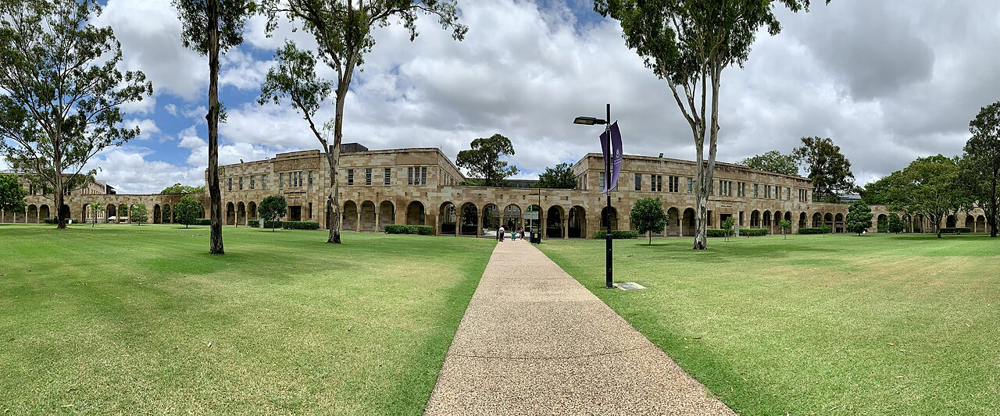

Photo: The Great Court, UQ St Lucia Campus — Kgbo, <a href="https://commons.wikimedia.org/wiki/File:The_Great_Court,_St_Lucia_Campus,_University_of_Queensland,_Brisbane_02.jpg" rel="noopener">Wikimedia Commons</a>, CC BY-SA 4.0

## UQ Japanese Researchers' Network

ようこそ。**UQ日本人研究者交流会（UQ Japanese Researchers' Network, UQ-JRN）**のページにお越しいただきありがとうございます。

この会は、クイーンズランド大学（University of Queensland, UQ）に集う日本人研究者の交流を目的とした、ゆるやかな集まりです。専門分野や所属を問わず、お互いの研究や日々の暮らしについて気軽に語り合える場を目指しています。

不定期ではありますが、年に二回ほど、UQ構内の **[St Lucy Cafe](https://www.saintlucy.com.au/)** でランチの会を開いています。

メンバーには、UQの教員（faculty）をはじめ、訪問研究者、ポスドク、博士課程の大学院生など、さまざまな立場の研究者が含まれます。**どなたでも大歓迎です。**

この会は **Satoshi Tanaka（[ウェブサイト](./index.html)）** が世話役を務めています。ご関心のある方は、下記までお気軽にご連絡ください。

**連絡先:** <email>s.tanaka (at) uq.edu.au</email>
