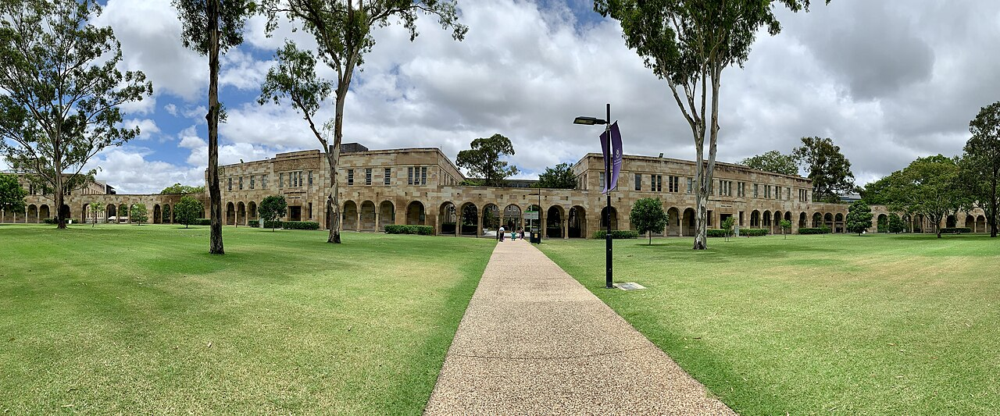

Photo: The Great Court, UQ St Lucia Campus — Kgbo, <a href="https://commons.wikimedia.org/wiki/File:The_Great_Court,_St_Lucia_Campus,_University_of_Queensland,_Brisbane_02.jpg" rel="noopener">Wikimedia Commons</a>, CC BY-SA 4.0

# UQ Japanese Researchers’ Network (UQ-JRN)
UQ Japanese Researchers’ Network（UQ-JRN）は、The University of Queensland（UQ）に所属・滞在する日本人研究者を中心とした、学術交流および専門的なネットワーク形成を目的とする研究者ネットワークです。研究分野や所属部局を越えて研究者間の連携を促進し、研究・教育・大学業務に関する情報や経験を共有する機会を提供することを目的としています。

### Purpose
UQ-JRNでは、主に以下のような研究者間の情報交換およびネットワーキングを行っています。

- 研究活動、研究環境、研究資金等に関する情報交換
- 異なる研究分野に所属する研究者間の学術的ネットワーク形成
- UQにおける研究・教育活動や大学制度に関する情報共有
- 訪問研究者、ポスドク、大学院生を含む研究者間の専門的な交流
- 新たにUQに着任・滞在する研究者への研究環境に関する情報提供

特定の研究分野に限定せず、分野横断的な研究者ネットワークとして運営しています。

### Members
UQ-JRNには、UQの教員（academic staff / faculty）、訪問研究者（visiting researchers）、ポスドク研究員（postdoctoral researchers）、博士課程の大学院生（HDR / PhD candidates）など、さまざまな分野・キャリアステージの研究者が参加しています。UQに所属している、または研究・教育活動を通じてUQと関係のある日本人研究者の方で、本ネットワークの趣旨にご関心のある方からのご連絡を歓迎します。

### Networking Meetings
研究分野を越えた情報交換の機会として、**年に2回程度、UQ St Lucia Campusにおいてネットワーキング・ミーティングを開催しています。** 通常は昼食時間を利用して実施し、各参加者の研究活動や研究環境、大学での研究・教育に関する情報交換を行っています。開催日時や場所については、参加者に事前に案内しています。

### Coordination
UQ-JRNは、UQに関係する研究者による自主的なprofessional networkとして運営されています。

Coordinator:

**Satoshi Tanaka**  
Associate Professor  
School of Economics
The University of Queensland
Website: [Satoshi Tanaka](./index.html)

研究者ネットワークへの参加や活動に関するお問い合わせは、下記までご連絡ください。

**Contact:** <email>s.tanaka (at) uq.edu.au</email>
